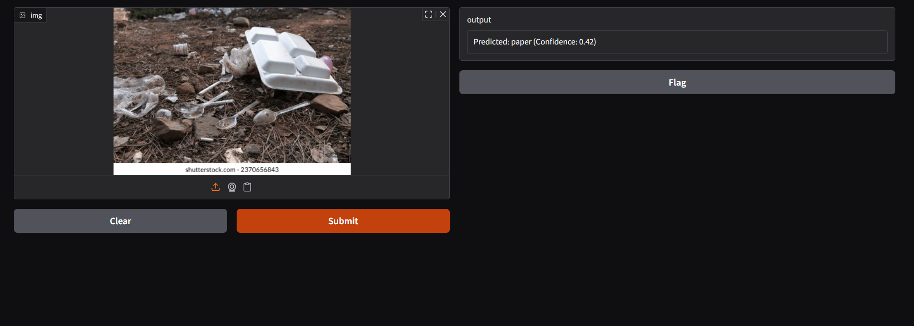

# 🗑️ Garbage Classification using Deep Learning

This project classifies garbage images into their respective categories (e.g., plastic, metal, organic) using a deep learning model built with **transfer learning**. It includes a simple and intuitive **Gradio-based web interface** for real-time image prediction.

---

## 🚀 Overview

- ✅ Built with **EfficientNet** (or your transfer learning model)
- ✅ Trained on a labeled garbage dataset
- ✅ Integrated with **Gradio** for a fast and clean web interface
- ✅ Classifies garbage into categories like **Plastic, Glass, Metal, Organic, Paper, etc.**

---

## 🧠 Model Architecture

- Base Model: `EfficientNetV2B2` (or your selected pre-trained CNN)
- Classification Head: Dense layers + Softmax
- Loss Function: `categorical_crossentropy`
- Optimizer: `Adam`
- Metrics: `Accuracy`

---

## 🖼️ Web Interface (Gradio)

The web app allows users to:

- Upload an image of garbage
- Click **"Submit"**
- View the predicted class and confidence score

> Built with `gr.Interface()` for fast prototyping and demo.

---

## 📷 Screenshot

---

## 🛠️ Tech Stack

- **TensorFlow / Keras**
- **Transfer Learning (EfficientNet or ResNet)**
- **Gradio for UI**
- **Matplotlib, Seaborn** for visualization
- **NumPy, Pandas** for preprocessing

---

## 📁 Project Structure
garbage-classifier/
│
├── Garbage_Classifier.ipynb # Training and evaluation code
├── model/ # Trained model files (.h5 or .keras)
├── app.py # Gradio app script
├── requirements.txt # Python dependencies
├── screenshots/
│ └── garbage_ui.png # UI screenshot
├── README.md # You're reading it!
└── .gitignore

📥 Dataset
Source: [Kaggle Garbage Classification Dataset](https://www.kaggle.com/datasets/farzadnekouei/trash-type-image-dataset)
Classes: Plastic, Paper, Glass, Organic, Metal, etc.
Dataset not included in repo — please download separately.
